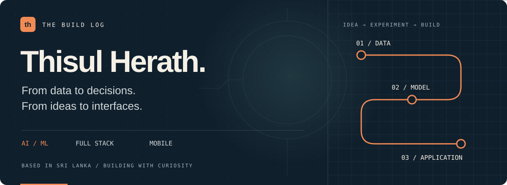
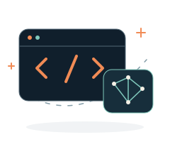
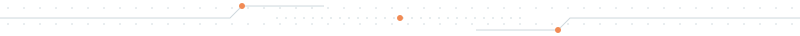
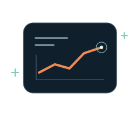
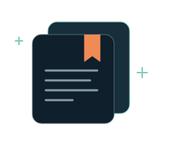
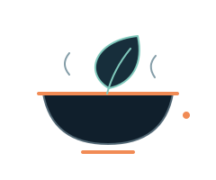
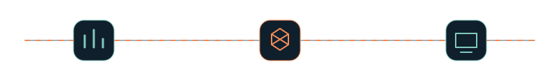

  

  
  
  
  

# Hi, I'm Thisul.

An IT undergraduate in **Sri Lanka**, working across **machine learning, full-stack development, and mobile apps**. I'm interested in what happens after the experiment: turning a model into an API, connecting it to an interface, and making something people can use.

I started with Java, fell for Python, and kept following the ideas that needed both data and software.

**Currently exploring:** advanced NLP, AI/ML projects, and React Native. 
**Open to:** AI/ML collaborations and conversations about building useful software.

 

## 01 / A few things I've been building

### [Telco Customer Churn](https://github.com/ThisulHerath/Telco-Customer-Churn-ML)

**From a customer dataset to a prediction service.** A machine learning pipeline covering data preparation, feature engineering, experiment tracking, and API serving, with a container build workflow.

`Python` · `MLflow` · `FastAPI` · `Docker` · `GitHub Actions`

 

### [UniVault](https://github.com/ThisulHerath/UNI-VAULT)

**A shared home for student knowledge.** A mobile platform for sharing study notes, reviewing resources, organizing collections, and forming study groups.

`React Native` · `Expo` · `TypeScript` · `Node.js` · `MongoDB`

 

### [ShareBite LK](https://github.com/ThisulHerath/ShareBite-LK)

**Connecting surplus food with people nearby.** A team project for Sri Lankan businesses to list surplus food and for individuals and community groups to discover and reserve it before collection deadlines.

`React` · `Vite` · `Express` · `MongoDB` · `JWT`

 

 

## 02 / My workbench

**Data & intelligence** 
Python, R, SQL · scikit-learn, TensorFlow, PyTorch · Pandas, NumPy, Jupyter

**Interfaces & applications** 
JavaScript, TypeScript, Java · React, React Native, Node.js, Express, Spring Boot

**Storage & delivery** 
MongoDB, PostgreSQL, MySQL, Supabase · Git, Docker, GitHub Actions, Postman, Ubuntu

  
More tools from my original toolkit

  C++, HTML, CSS, Keras, OpenCV, and Matplotlib.

 

## 03 / The thread connecting the work

  

Customer churn, student resources, surplus food: different problems, but the same pull toward making information useful.

My next chapter is about bringing those interests closer together: **NLP, intelligent applications, and the interfaces that make them approachable.**

 

## 04 / Start a conversation

Have an AI/ML idea, a dataset worth exploring, or a project we could build together? Tell me what you're working on.

  
  
  

**[thisulh@gmail.com](mailto:thisulh@gmail.com)** · **[Visit my portfolio](https://portfolio-lemon-two-47.vercel.app/)**

  THISUL HERATH &nbsp; / &nbsp; SRI LANKA &nbsp; / &nbsp; THE BUILD LOG CONTINUES

